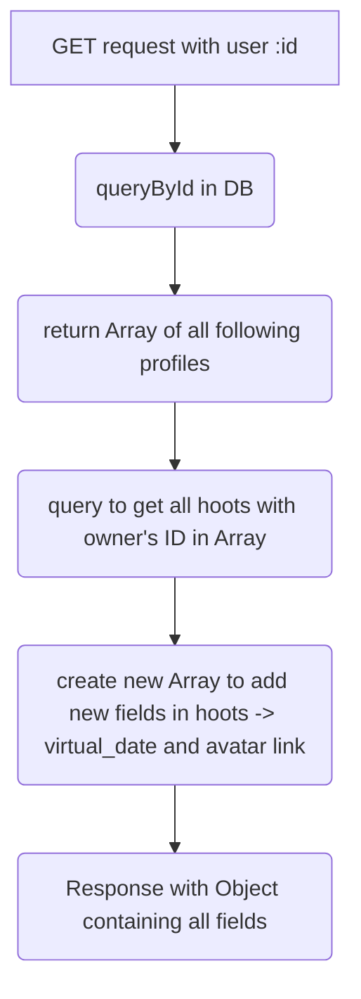
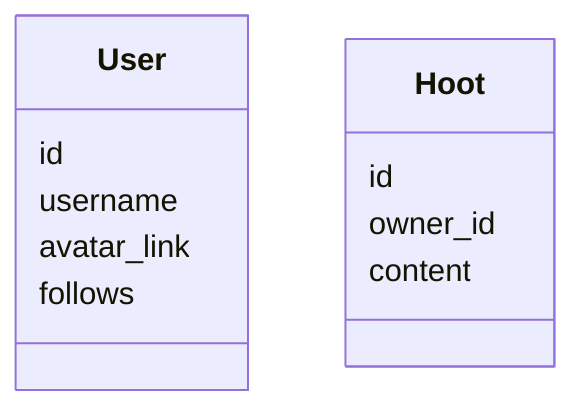
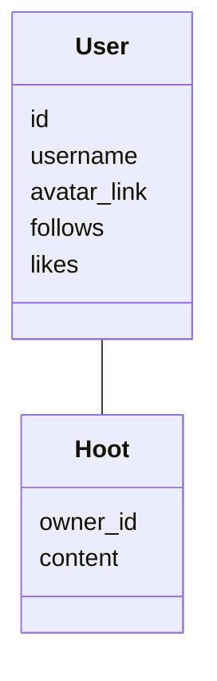

# My project journey

## I'll use this jornal to comment on the project and when I find something difficult, note it down.

## 22 Fev - Problem: Implementing async.waterfall in controller methods
I wanted to get the information about each Hoot(tweet), to display it. The idea was make one GET request to get all the hoots(tweets) from all users they follow.
    
So the pipeline for the controller method was:

The database structure:

I needed to use the current user name and avatar, so in the controller method, inside the function to create a new list, I made a query to get the list

avatar link. The problem was that this query was inside a for loop, which would finish after the function, so the result would be empty. I tried to use

async methods as waterfall but didn't work.

So, as we can see, my database has no relationship. Thats why I decided to refactor my database structure, and try another approach to the problem.

I'm just linked the two collections.

## 25 Fev - Getting fields from Ref id
using mongoose .populate() gets the filds from the Ref collection. I choose to only populate with some fields

## 7 march - Deploy vercel
when creating a new project in vercel, in the configuration, overwrite build settings with: CI= npm run build

## What's next?
- use [TLS](https://en.wikipedia.org/wiki/Transport_Layer_Security) to secure the connection and the data
- get a [free TLS certificate](https://letsencrypt.org/about/)
- Cache request results
- Add another language support
