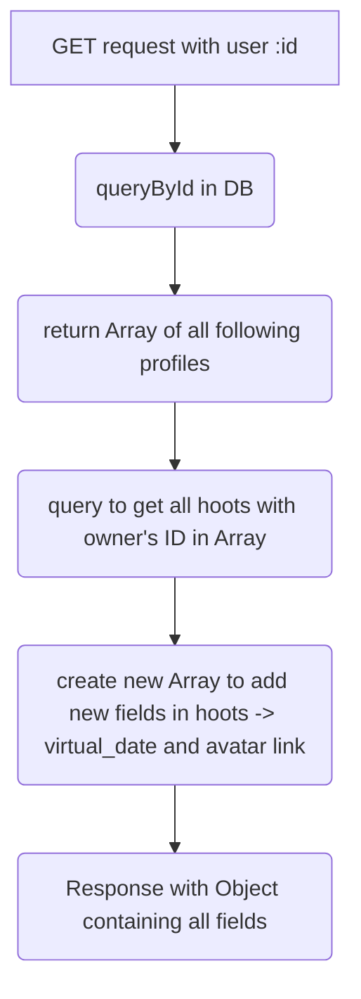
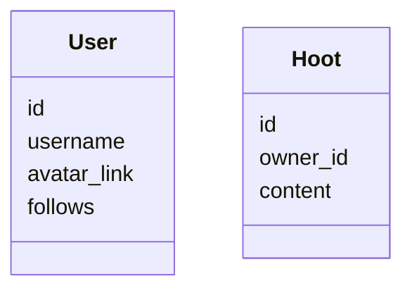
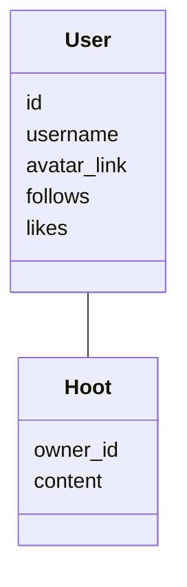

# My project journey

## I'll use this jornal to comment on the project and when I find something difficult, note it down.

## 10 Fev - Compose tweet
The original compose tweet is not a simple text field. Instead, it is a div with the editable option on. This makes it easy to have different functionalities in this input field.

For example, you can paste the clipboard, can format the text to be read at a certain point, can add mentions and so on. You can

some links for helping creating this functionality:

  - [React.js Conf 2016 - Isaac Salier-Hellendag - Rich Text Editing with React](https://www.youtube.com/watch?v=feUYwoLhE_4)
  - https://codepen.io/hus_hmd/pen/zPxJBp
  - https://codepen.io/mark_alves/pen/JjOyjmy
  - [Twitter Tweet Box Clone Html Css Javascript | Twitter Clone](https://www.youtube.com/watch?v=E2YLdrXobmI)
  - [Twitter Tweet Box with Character Limit Highlighting using HTML CSS & JavaScript](https://www.youtube.com/watch?v=_pbuwzly6xA)
  - [How does Twitter implement its Tweet Box?](https://stackoverflow.com/questions/28820293/how-does-twitter-implement-its-tweet-box)

## 22 Fev - Problem: Implementing async.waterfall in controller methods
I wanted to get the information about each Hoot(tweet), to display it. The idea was make one GET request to get all the hoots(tweets) from all users they follow.
    
So the pipeline for the controller method was:

The database structure:

I needed to use the current user name and avatar, so in the controller method, inside the function to create a new list, I made a query to get the list

avatar link. The problem was that this query was inside a for loop, which would finish after the function, so the result would be empty. I tried to use

async methods as waterfall but didn't work.

So, as we can see, my database has no relationship. Thats why I decided to refactor my database structure, and try another approach to the problem.

I'm just linked the two collections.

## 25 Fev - Getting fields from Ref id
using mongoose .populate() gets the filds from the Ref collection. I choose to only populate with some fields

## 7 march - Deploy vercel
when creating a new project in vercel, in the configuration, overwrite build settings with: CI= npm run build

## 8 march - Using window size to render isComponents
I was making the app responsive to smaller devices, and was planning to using only CSS. But at some point I noticed I'd have to use some variable to store the
window size so I could render components using ternary.

I had to refector my user card component (the one that logs you out), because its structure was too hard for making it responsive, and I also wanted to
be closer to the twitter app. I made it position fixed, and used the component Ref to get the width of the Nav bar. I had some difficulty with getting
the component width using useEffect, because the Nav component was rendering before the Main component was mount, so the Ref was setting the width before all
component of the page were rendered, so I did some research and found a solution using ResizeObserver.

## 10 march - Create Readme for project
In the readme I intend to explain my project goals and show some of it. I will show the project structure in a graph I created in Figma, and a small demo of the app with a video.

## What's next?
- use [TLS](https://en.wikipedia.org/wiki/Transport_Layer_Security) to secure the connection and the data
- get a [free TLS certificate](https://letsencrypt.org/about/)
- Cache request results
- Add another language support
- Use websockets for messaging
